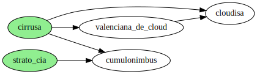

| provider                | cost    | sla    | green energy | child labor |
| ----------------------- | ------- | ------ | ------------ | ----------- |
| cloudisa                | 9.103 € | 95 %   | no           | yes         |
| valenciana de cloud s.l | 9.081 € | 99 %   | no           | yes         |
| cumulonimbus s.l        | 9.106 € | 95 %   | yes          | yes         |
| cirrusa                 | 9.081 € | 99 %   | yes          | yes         |
| strato y cia.           | 9.104 € | 99.9 % | yes          | no          |

## Pareto dominancia

## Frontera de Pareto

**strato y cia.**
Es una pareto mejora con Cumulonimbus.

**cirrusa**
Es un pareto mejora con todas salvo Strato y cia.

## Proveedor de cloud

### a

¿Qué opción escogerías? ¿Por qué?

- Escogería Cirrusa porque mejora a todas menos a Strato y cia que tiene un precio sustancialmente superior. Podría optar por Strato y Cia si las mejoras me compensan el extra de dinero, pero eso no lo tengo claro.

### b

¿La opción que has escogido está en la frontera de pareto?

Si

### c

¿La opción que has escogido pareto-domina a nuestro provider actual, cloudisa?

Si
